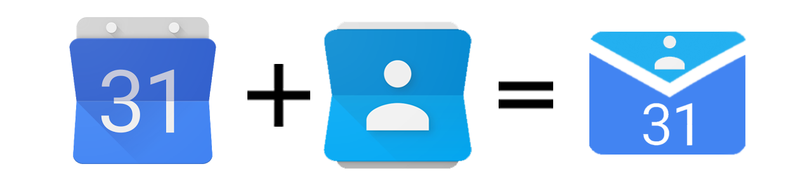

# Google Contacts Events Notifier

Receive customized email notifications to alert you about incoming birthdays or
other events of your Google contacts.

Have you ever wondered why on Earth would Google Calendar provide a calendar to
remind you of your contact birthdays, but without letting you set up
notifications for its events?  
I did. And after hours of fruitless searching and browsing I found [a post in
the Google Help Forum][Original Google Help Forum Post] which seemed to provide
a solution, however it did not quite work.

This project takes inspiration from that code to solve the problem of the
missing notifications on Google Calendar Birthday Calendar.

<!-- TOC -->

- [Google Contacts Events Notifier](#google-contacts-events-notifier)
  - [Installation and setup](#installation-and-setup)
  - [Additional information](#additional-information)
    - [Stopping/uninstalling/deleting the script](#stoppinguninstallingdeleting-the-script)
    - [Blacklisting specific events for specific contacts](#blacklisting-specific-events-for-specific-contacts)
    - [Translation](#translation)
    - [Bug and error reporting, help requests](#bug-and-error-reporting-help-requests)
      - [Unresponsive help requests](#unresponsive-help-requests)
    - [Updating the script](#updating-the-script)
    - [Permissions required](#permissions-required)
  - [Contributing](#contributing)
  - [License](#license)
  - [Credits](#credits)

<!-- /TOC -->

## Installation and setup

Follow [this guide][Setup and installation guide] to install and setup the
script correctly.

## Additional information

### Stopping/uninstalling/deleting the script

If you just want to stop receiving the notifications, but want to keep the
script for future use just open your script and click `Run->notifStop` in the
menu at the top.

If you want to stop using the script and want to delete it completely follow
these steps:

1. Locate the script in [Google Drive][Google Drive website]:
   - It should be in the folder you put it into when you created it.
   - If you deleted the file you can look in the [trash folder][Google Drive
     trash] and recover it from there.
2. Open the script and click `Run->notifStop` in the menu at the top.
3. In the same menu click `Run->notifStatus`, then `View->Log` and confirm that
   the notifications were stopped successfully.
4. Close the script and open [this Google page][Google connected apps], find the
   the script (it should have the name you gave it during installation) and
   click on "Remove access"
5. If everything went right it should be safe to delete the script file from
   Google Drive.  
   If you want to be extra sure you can wait some days to confirm that no email
   is sent to you anymore and only then delete the script file: this is up to
   you.

### Blacklisting specific events for specific contacts

There are three event-types for which notifications can be statically
enabled/disabled for by editing the `settings.notifications.eventTypes`
configuration variable at the top of the script:

1. `Birthday`
2. `Anniversary`
3. `Custom`

but you can also achieve more fine-grained control per-contact by adding a
custom-field when editing a contact (click `Add->Custom...`), setting the label
of that field to `notificationBlacklist`, and setting its content to a
comma-separated list of field-names. In the following example, the script would
notify about Fred's birthday but not his anniversary or his SpecialSecretDay due
to the blacklist:

- `Name`                  -> `Fred`
- `Birthday`              -> `1 January 1970`
- `Anniversary`           -> `31 December 1995`
- `SpecialSecretDay`      -> `15 June 2001`
- `notificationBlacklist` -> `Anniversary,SpecialSecretDay`

To minimize confusion the blacklist matches case-insensitively, so for example
`ANNIVERSARY`, `Anniversary`, `anniversary`, or `AnNiVeRsArY` being in the
blacklist will all succeed in preventing anniversary notifications for the
contact.

### Translation

The text of the email notification can be translated into any language if a
translation for that language is provided to the script. Some languages already
have a translation, but you can easily add your own.

To learn more about translations (how to create your own one, how to share it
with us so that it can be used by other users...) please read the [translation
guide][Translation guide].

### Bug and error reporting, help requests

First of all _before submitting a new error, bug or help request_, please,
__verify that you followed [the setup instructions][Setup and installation
guide] to the letter.__

To report a bug or an error or to request help with this script please use [this
project GitHub issue page][Project issue page]: the collaborators will be
notified immediately and will provide help as soon as possible.

Please follow the template provided (which you can also [preview here][Issue
template file]) when opening a new issue and include:

- A __meaningful description of the problem__. What did you do? What happened?
  What did you expect to happen instead?
- A __full copy of any error message you received or of the thing that went
  wrong__. Please be advised that it could contain personal information such as
  your email: obscure or remove them as all the issues and relative messages are
  publicly visible.

These pieces of information are really necessary: without them nobody will be
able to help you.

#### Unresponsive help requests

If you open a help request issue please do not abandon it until it's been solved
and closed. If you want to close it before explicitly state this intention with
a message in the issue.

Issues marked with the `help request` tag that are unresponsive will be sent a
reminder message after three days since the last message from the user and the
issue will be marked with the `unresponsive` tag. If the user still does not
respond to the issue, after a month the issue will be closed.

If you want to re-open a closed `help request` issue ask for this by commenting
on it.  
Only the user which has originally opened the issue can ask for it to be
re-opened.

### Updating the script

This script is constantly updated to fix bugs and add new features: keeping it
updated to the latest version is really easy:

1. Whenever a new stable version is released you will see a line of text at the
   end of your daily email notification telling you to click on a link to get
   the latest version;
2. If you do so you will be taken to a page with a description of the new
   release;
3. The description will contain a precise step by step guide on how to update
   the script to this version: follow it closely and you should not have any
   problem;
4. You might want to follow the setup procedure again, because some steps might
   have been added in the new version since the previous one.
5. After updating the code always click `Run->notifStop` and `Run->notifStart`
   in the top menu to finish the update process.

Note: you might be asked to grant some new permissions to the script. There is
nothing wrong with this: it just means that the new version requires some
permissions that the previous version did not.  
You can read the full list of the permissions and why they are required
[here][Permissions list]

### Permissions required

When running the script for the first time or after an update you might be asked
by Google to "grant some permissions" to the script. This happens because the
script needs your explicit permission to access your data.

This is an exhaustive description of the reason the script needs each of the
permissions:

- **Know your age range and language + View your email addresses**  
  This is needed to retrieve information about your Google Plus contacts,
  especially those who you have not added in your Google Contacts, but just
  followed on Google Plus. The script will only get information about people who
  appear in your birthday calendar. If you prefer to not access Google Plus at
  all set `settings.user.accessGooglePlus = false` before running any functions
  and do not enable the Google+ API (then you won't be prompted for this
  permission).
- **Manage your Google Contacts**  
  This lets the script access information about your contacts (names, email
  addresses, birthdays). The script will not modify any of your contacts.
- **Manage your calendars**  
  This lets the script access your birthday and events calendar. The script will
  get the events from this calendar only and will never modify any event or
  calendar.
- **Allow this application to run when you are not present**  
  This is needed to run the script every day at the hour you specified.
- **Send email as you**  
  Obviously this script needs your authorization to send you the email
  notifications. It won't send any other email to anyone.
- **Connect to an external service**  
  This permission is needed to check for updates and to load the profile images
  of your contacts.

## Contributing

Google Contacts Events Notifier is an open source project: if you want to
know how to contribute please read the [CONTRIBUTING][Contributing file] file.

If you just want to contribute with a translation then the [translation
guide][Translation guide] might be a better place to start.

## License

Google Contacts Events Notifier is licensed under the [MIT license][License
file].

## Credits

- [GioBonvi (Giorgio Bonvicini)][Github GioBonvi] created the project and is
  primary maintainer;
- Google user `ajparag` for the [code][Original Google Help Forum post] that
  inspired this project;
- [rowanthorpe (Rowan Thorpe)][GitHub rowanthorpe], whose help was invaluable:
  he added many new features, refactored the code heavily and solved many bugs;
- [baatochan (Bartosz Rodziewicz)][Github baatochan], for his various contributions
  both in solving issues and in adding new features;
- those users who provided translations for the script:
  - [rowanthorpe (Rowan Thorpe)][GitHub rowanthorpe] - Greek;
  - [lboullo0 (Lucas)][Github lboullo0] - Spanish;
  - [muzavan (Muhammad Reza Irvanda)][Github muzavan] - Indonesian;
  - [DrKrakower][Github DrKrakower] and Simone Sottopietra - German;
  - [cezarylaksa][Github cezarylaksa] and [baatochan (Bartosz
    Rodziewicz)][Github baatochan] - Polish;
  - [JayForce][GitHub JayForce] - French;
  - [88scythe][GitHub 88scythe] - Dutch;
  - [miguel-r (Miguel Ribeiro)][Github miguel-r] - Portuguese;
- all the other contributors who are listed [here][Project contributors page];

[Project documentation]: https://giobonvi.github.io/GoogleContactsEventsNotifier
[Project issue page]: https://github.com/GioBonvi/GoogleContactsEventsNotifier/issues
[Project contributors page]: https://github.com/GioBonvi/GoogleContactsEventsNotifier/graphs/contributors
[Permissions list]: #permissions-required
[Issue template file]: .github/ISSUE_TEMPLATE.md
[Contributing file]: .github/CONTRIBUTING.md
[License file]: LICENSE
[Setup and installation guide]: docs/install-and-setup.md
[Translation guide]: docs/translation-guide.md
[Google Drive website]: https://drive.google.com/drive/
[Google Drive trash]: https://drive.google.com/drive/trash
[Google connected apps]: https://myaccount.google.com/permissions
[Original Google Help Forum Post]: https://productforums.google.com/d/msg/calendar/OaaO2og9m5w/2VgNNNF5BwAJ
[Github GioBonvi]: https://github.com/GioBonvi
[GitHub rowanthorpe]: https://github.com/rowanthorpe
[Github lboullo0]: https://github.com/lboullo0
[Github muzavan]: https://github.com/muzavan
[Github DrKrakower]: https://github.com/DrKrakower
[Github cezarylaksa]: https://github.com/cezarylaksa
[Github baatochan]: https://github.com/baatochan
[Github JayForce]: https://github.com/JayForce
[Github 88scythe]: https://github.com/88scythe
[Github miguel-r]: https://github.com/miguel-r
