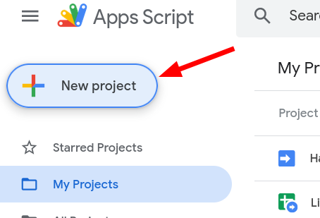
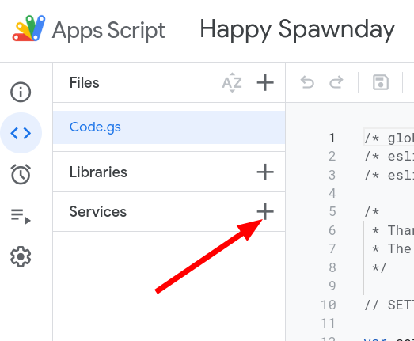
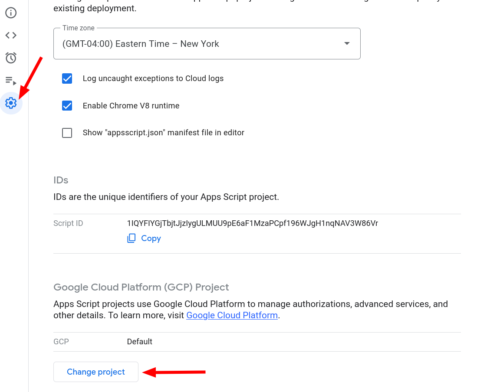
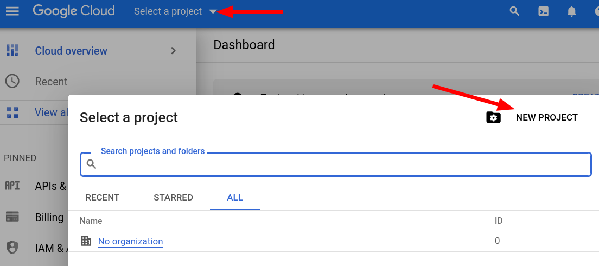
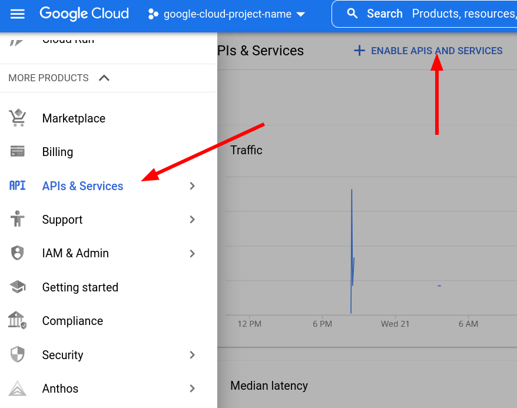
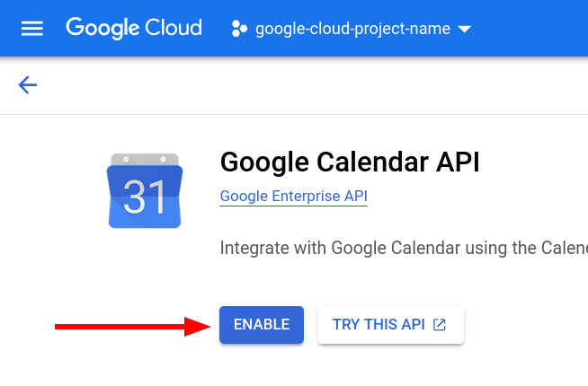

# Installation and setup

Follow these instructions to install and setup the script correctly.

<!-- TOC -->

- [Installation and setup](#installation-and-setup)
  - [Enable the calendar](#enable-the-calendar)
  - [Create the script](#create-the-script)
  - [Customize the script](#customize-the-script)
    - [Mandatory customization](#mandatory-customization)
    - [Optional customization](#optional-customization)
    - [Debugging options](#debugging-options)
    - [Developer options](#developer-options)
  - [Activate API for the script](#activate-api-for-the-script)
  - [Grant rights to the script](#grant-rights-to-the-script)

<!-- /TOC -->

## Enable the calendar

First of all you need to enable your contacts birthday and events calendar in
your Google Calendar (read [this Google help page][Google setup birthday
calendar] to know how to do it).

## Create the script

Copy the whole content of [this file][Main code file].  
Open [Google Script][Google scripts website] and login if requested,
click "New Script", then paste the code into the page.

## Customize the script

Now read carefully the code you've pasted. At the top of the file you will find
some lines you need to modify along with many lines of instructions. Edit the
values as explained by the instructions.  

Once you're done editing the variables click `File->Save` in the menu and enter
a name for the script (it doesn't really matter, just name it so that you'll
recognize it in the future).

The customization variables can be categorized in three groups.

### Mandatory customization

These are the first settings you will find: these are variables that you
**must** initialize correctly, otherwise the script will not work at all.  
These are the names of the variables:

- `settings.user.googleEmail`
- `settings.user.notificationEmail`

### Optional customization

This second group of settings contains some variables that you could leave as
they are, but you are warmly encouraged to edit them to fit your exact needs.  
These are the names of the variables:

- `settings.user.emailSenderName`
- `settings.user.lang`
- `settings.notifications.hour`
- `settings.notifications.timeZone`
- `settings.notifications.anticipateDays`
- `settings.notifications.eventTypes`
- `settings.notifications.maxEmailsCount`
- `settings.notifications.maxPhonesCount`
- `settings.notifications.indentSize`
- `settings.notifications.compactGrouping`

### Debugging options

Variables in this group are used to debug and troubleshoot the script when it
does not work as intended. Generally you should not need to edit these values,
but you may be asked to do so if you submit a help request.  
These are the names of the variables:

- `settings.debug.log.filterLevel`
- `settings.debug.log.sendTrigger`
- `settings.debug.testDate`

### Developer options

This list just provides a convenient place for the developers and/or maintainers
to update variables without searching through the code. For normal use you
should never need or want to edit these.

- `settings.developer.version`
- `settings.developer.repoName`
- `settings.developer.gitHubBranch`

## Activate API for the script

Now that the script is saved in your Google Drive folder we need to activate it.
To do so click the Services menu on the left-hand side.
In the popup which will open set "Calendar API" to `enabled` (click the switch
on its row on the right) and press "Okay".

Next, you need to attach a Google Cloud Platform project to your script.
Open the Settings for your scripts in the far left,
and navigate to the section that says "Google Cloud Platform (GCP) Project",
then click the "Change Project" button.

We're prompted for a project number.
To get one, follow the instructions in Step 1; that is, open the
[Google Cloud Platform API Dashboard][Google Cloud Platform API Dashboard]
and create a new Google Cloud project
(or, you can use an existing one if you already have one).

Once you have a project either created or selected,
you should then see a project number on the dashboard.
Input it back on the prompt from the Scripts page to link the two together.

Once you have done this, go back to the [Google Cloud Platform API Dashboard][Google Cloud
Platform API Dashboard] and (with your project selected),
open the hamburger menu on the left and scroll through the myriad of services
until you find "API & Services".
This takes you to a page which has a button "Enable API's and Services" at the
top; click that one.

This opens up an enormous list of various API's
Search for "Google Calendar API" in the search box and open it.
Now click `Enable` and close this page.

That's it for this step.

**Important note**: please double check that you have performed **all** steps
correctly as this seems to be the cause of many reported errors.

## Grant rights to the script

We have given the script access to the resource it needs to work: now the last
step is granting it the rights to access those resources. To do so click on the
menu `Run->notifStart`. You will be prompted to "Review authorizations": do it
and click `Allow` (You can read the full list of the permissions and why they
are required [here][Permissions list]).
During this phase you might be prompted with a "This app isn't verified" error
message: in this case you'll have to click on "Advanced" and click on the link
that will appear to continue with the setup.

From this moment on you will always receive an email before any of your
contacts' birthday (You should have set how many days before at the beginning).

[Main code file]: https://raw.githubusercontent.com/GioBonvi/GoogleContactsEventsNotifier/master/code.gs
[Google Scripts website]: https://script.google.com
[Google setup birthday calendar]: https://support.google.com/calendar/answer/6084659?hl=en
[Permissions list]: ../README.md#permissions-required
[Google Cloud Platform API Dashboard]: https://console.cloud.google.com/apis/dashboard
